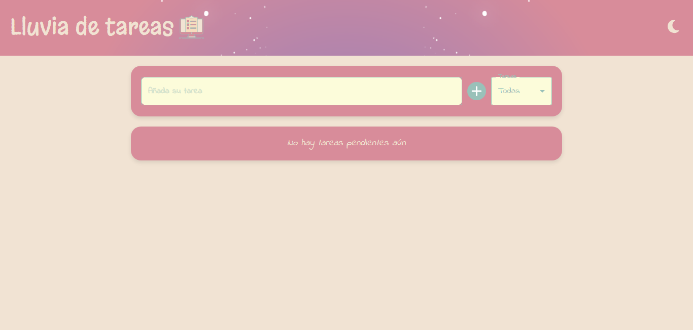
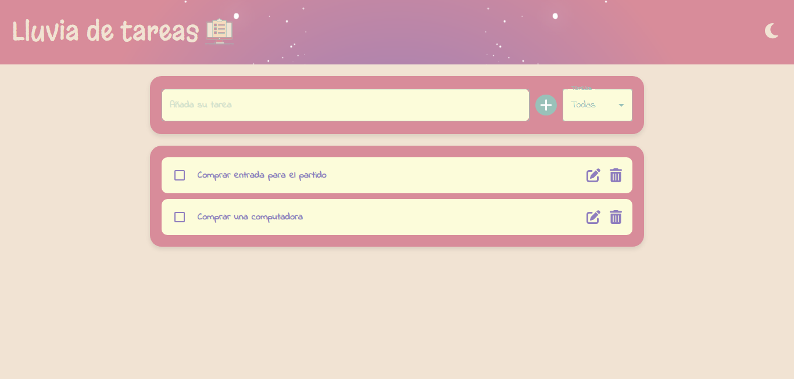
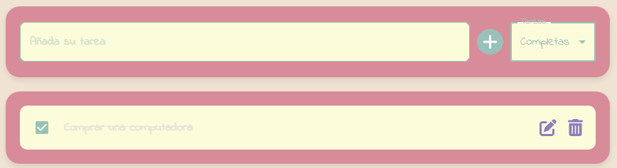
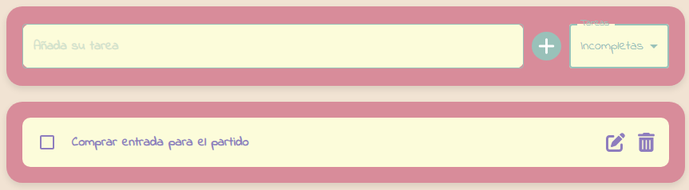
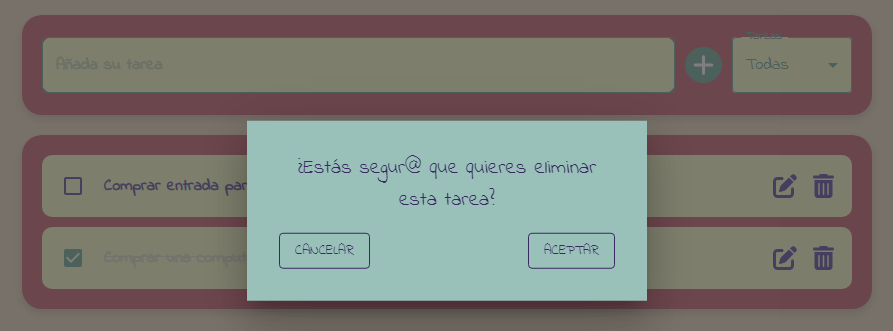
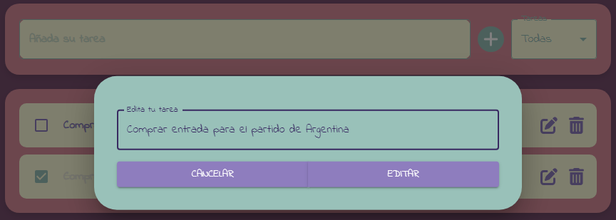
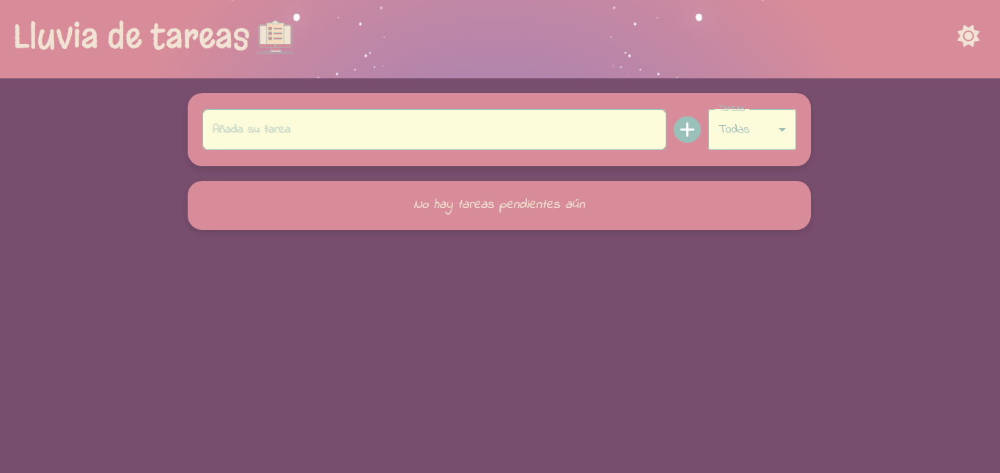

# ˗ˏˋ ★ TODOLIST ★ ˎˊ˗

Te presento **⋆⭒˚.⋆☂LLUVIA DE TAREAS☂⋆⭒˚.⋆**, una aplicación diseñada para ayudarte a organizar y gestionar tus tareas diarias de manera eficiente, mientras añades un toque de creatividad y estilo a tu rutina. Esta lista de tareas no es solo una herramienta funcional, sino también una expresión de personalidad y organización.

## Estructura de la Web 💻

En la **página de inicio** de mi web, encontrarás un **header** que destaca con el título **⋆⭒˚.⋆☂LLUVIA DE TAREAS☂⋆⭒˚.⋆**. Además, cuenta con un práctico cambiador de tema que te permite alternar entre el modo claro y oscuro, adaptándose a tus preferencias de visualización.

## Funcionalidad ✨

La funcionalidad principal de la aplicación es agregar nuevas tareas. Simplemente presionando el botón correspondiente, las nuevas tareas aparecerán ordenadamente en la lista de abajo.

### Se pueden filtrar por

#### Tareas Completas

Al filtrar por tareas completas, solo se mostrarán aquellas que ya has marcado como realizadas.

#### Tareas Incompletas

Si decides filtrar por tareas incompletas, podrás ver todas aquellas que aún necesitas realizar.

#### Eliminar Tareas

Para eliminar una tarea, simplemente haz clic en el ícono de la papelera. Se te mostrará un mensaje de confirmación para asegurarte de que realmente deseas eliminarla.

#### Editar Tareas

Si necesitas modificar una tarea, puedes hacerlo fácilmente haciendo clic en el ícono de edición. Se abrirá una ventana emergente donde podrás realizar los cambios necesarios.

#### Cambiar Tema

El botón de la luna te permite cambiar el tema de la aplicación, ofreciéndote una mejor visibilidad según tus necesidades, ya sea en un entorno claro o oscuro.

### Tecnologías Utilizadas 💻

Este proyecto está construido utilizando **React** y **Material UI**, lo que asegura una experiencia de usuario moderna y una interfaz intuitiva.

### Créditos 🏅

Desarrollado con mucho 🤍 por **Male**.
